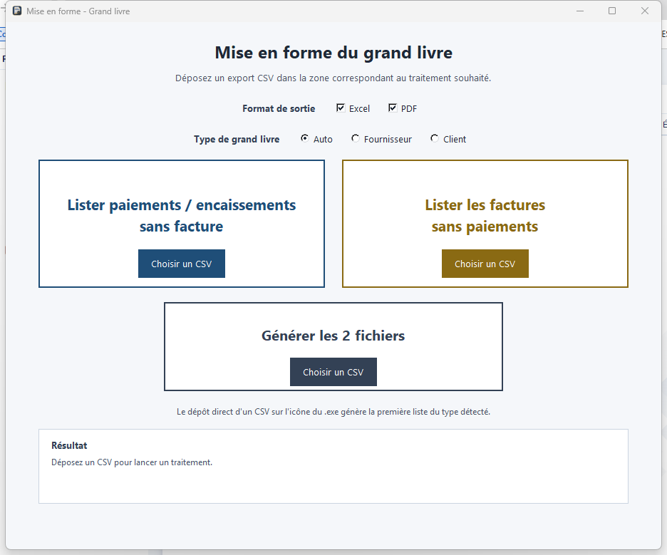

# Liste Tiime


Liste Tiime transforme localement un export CSV de grand livre en listes
Excel et PDF prêtes à être envoyées au client.



## Fonctionnalités

- Détection automatique d'un grand livre fournisseur (`401`) ou client (`411`).
- Paiements fournisseurs sans facture.
- Factures fournisseurs sans paiement.
- Encaissements clients sans facture de vente.
- Factures de vente sans paiement.
- Export Excel, PDF ou les deux.
- Glisser-déposer dans l'application ou directement sur l'exécutable.
- Masquage automatique des colonnes de remboursements ou d'avoirs vides.

## Confidentialité

Le traitement est entièrement local. Les CSV et les documents générés ne sont
envoyés à aucun service distant. Les workflows GitHub utilisent uniquement des
données de test synthétiques et ne contiennent aucune donnée client.

## Télécharger

Téléchargez `Liste Tiime.exe` depuis la page
[Releases](https://github.com/kamel934/RelanceTiime/releases).

La release indique explicitement si le fichier est signé ou non. Une fois le
projet approuvé par SignPath Foundation, Windows doit afficher
`SignPath Foundation` comme éditeur.

Vous pouvez vérifier l'intégrité du téléchargement avec le fichier
`SHA256SUMS.txt` publié dans la même release :

```powershell
Get-FileHash ".\Liste Tiime.exe" -Algorithm SHA256
```

## Utilisation

1. Ouvrez `Liste Tiime.exe`.
2. Choisissez `Excel`, `PDF` ou les deux.
3. Laissez le type sur `Auto`, ou forcez `Fournisseur` / `Client`.
4. Déposez le CSV dans la zone voulue.

Un CSV glissé directement sur l'icône génère la première liste correspondant
au type de grand livre détecté.

## Format CSV attendu

Le fichier doit être séparé par `;`, encodé en Windows-1252 et contenir au
minimum :

- `N° Compte`
- `Libellé du compte`
- `Date`
- `Journal`
- `N° de pièce`
- `Libellé mouvement`
- `Montant Débit`
- `Montant Crédit`

## Développement

Prérequis : Windows et Python 3.12.

```powershell
python -m venv .venv
.\.venv\Scripts\python.exe -m pip install -r requirements-dev.txt
.\.venv\Scripts\python.exe -m pytest -q
.\.venv\Scripts\pyinstaller.exe --clean --noconfirm "Liste Tiime.spec"
```

Le binaire est créé dans `dist\Liste Tiime.exe`.

## Signature

Le processus prévu pour les releases signées est décrit dans
[SIGNING_POLICY.md](SIGNING_POLICY.md). La signature gratuite dépend de
l'approbation du projet par SignPath Foundation. La fiche de candidature est
préparée dans [docs/SIGNPATH_APPLICATION.md](docs/SIGNPATH_APPLICATION.md).

## Licence

Ce projet est distribué sous licence [MIT](LICENSE).
